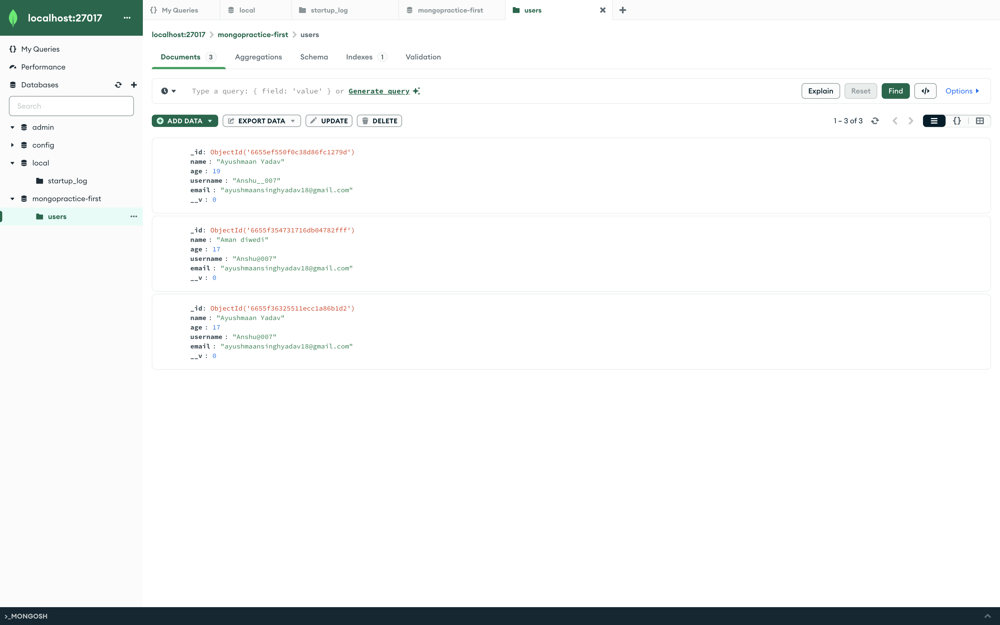

# MONGODB
## MONGO DB [ Mongoose ]


[](https://travis-ci.org/joemccann/dillinger)

LEARN ABOUT MONGO DB

- 1️⃣ Install MongoDB: Get started with the installation process.
- 2️⃣ Connect to MongoDB: Establish a connection to your database.
- 3️⃣ Mongoose Schema: Define your data structure.
- 4️⃣ Create Model: Build a model based on the schema.
- 5️⃣ Create User: Add new users to your DB.
- 6️⃣ What is _id?: Unique identifier for each document.
- 7️⃣ Update User: Modify user details.
- 8️⃣ Read Users: Fetch single or all user data.
- 9️⃣ Delete User: Remove users when needed.


## Installation

MongoDB Compass [MONGODB](https://www.mongodb.com/try/download/community)

Install the dependencies and devDependencies and start the server.

```sh
$ brew install mongodb-atlas
$ atlas setup
```

For production environments...

```sh
npm install nodemon
npx nodemon app.js

```

## Images




